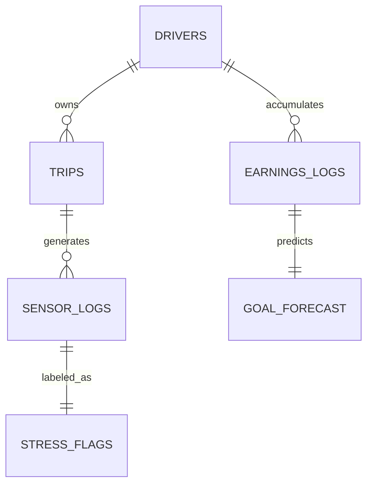
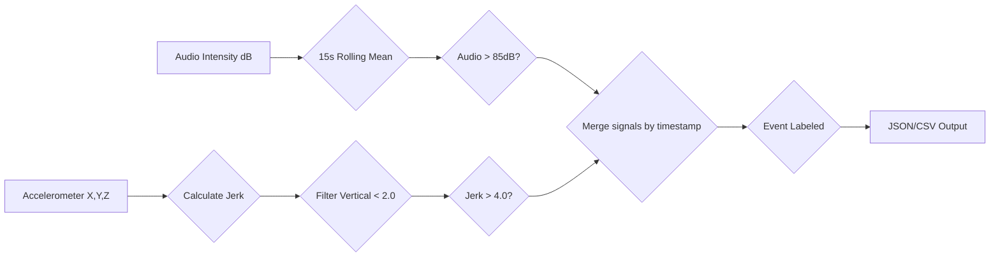
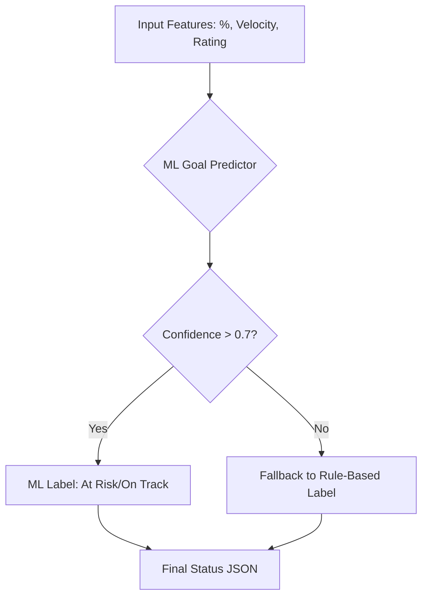
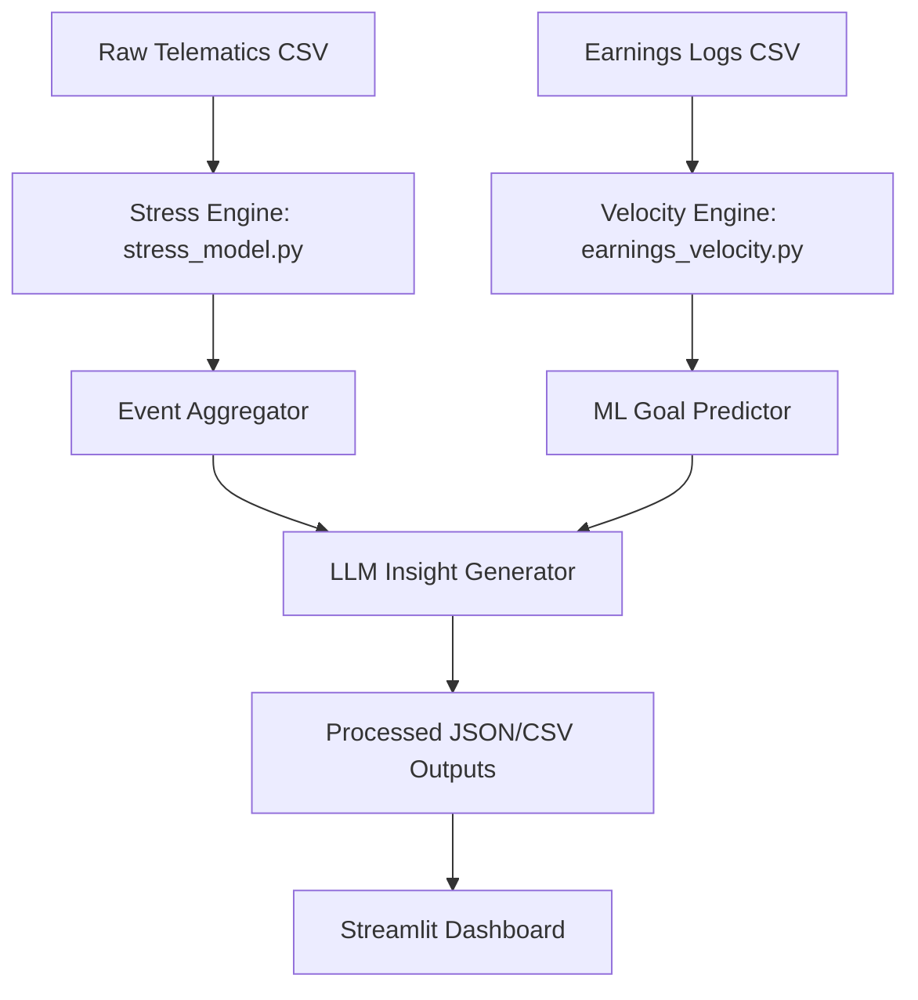
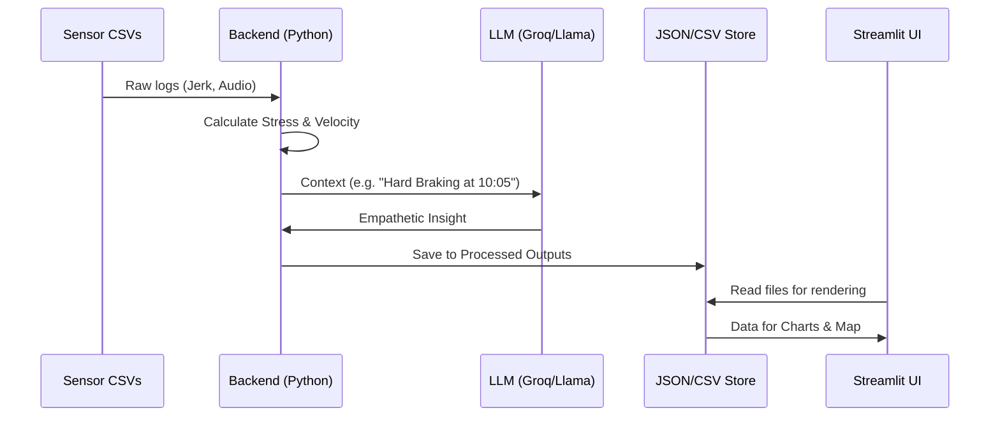

# Driver Pulse: Engineering Design Document
**Hackathon Submission: Group 14 - Uber Career Prep 2026**  
**Project:** Drive Pulse – Understanding Safety and Earnings Through Signals  

---

## Executive Summary
**Driver Pulse** is an experimental system designed to solve the "black box" feedback loop for Uber drivers. By fusing high-frequency telematics (accelerometer) with privacy-safe audio intensity signals, we detect stressful trip segments ("Flagged Moments") and provide real-time financial pacing ("Earnings Velocity"). Our goal is to transform raw system noise into empathetic, glanceable coaching that helps drivers like Alex reflect, plan, and adjust their shifts safely.

---

## Table of Contents
1. [Product Vision & User Persona](#1-product-vision--user-persona)
2. [Technical Requirements & Compliance](#2-technical-requirements--compliance)
3. [Stress Detection Algorithm (The Engine)](#3-stress-detection-algorithm-the-engine)
4. [Earnings Velocity & ML Goal Prediction](#4-earnings-velocity--ml-goal-prediction)
5. [GenAI Insights & Empathetic Coaching](#5-genai-insights--empathetic-coaching)
6. [System Architecture](#6-system-architecture)
7. [UI/UX Design Strategy](#7-uiux-design-strategy)
8. [Risks, Mitigations & Future Roadmap](#8-risks-mitigations--future-roadmap)

---

## 1. Product Vision & User Persona
### 1.1 The Persona: Alex
Alex is a professional driver who values autonomy but feels the pressure of uneven earnings and unpredictable passenger behavior. She often ends her shift with a single number—total earnings—missing the context of *why* certain trips felt stressful or *how* close she actually came to her goals.

### 1.2 The Value Proposition
- **Real-Time Pacing:** No more guessing if you're "ahead" or "behind."
- **Safety Reflection:** Identifies harsh braking or cabin conflict moments for post-shift review.
- **Empathetic Feedback:** Replaces raw error codes with supportive, AI-generated coaching.

---

## 2. Technical Requirements & Compliance
To meet the Uber Hackathon standards, the system implements the following:

| Requirement | Implementation Detail |
| :--- | :--- |
| **Modular Code** | Logic separated into `stress_model.py`, `earnings_velocity.py`, and `goal_predictor.py`. |
| **Thresholds** | Defined at **4.0 m/s²** for jerk and **85 dB** for audio intensity. |
| **Output Schema** | Structured `uber_compliance_log.csv` with 5 mandatory columns. |
| **Glanceable UI** | Tabbed Streamlit dashboard passing the "1-second safety test." |
| **Reproducibility** | Full `Dockerfile` and `requirements.txt` provided for one-command spin-up. |

### 2.1 Data Relationship Model

---

## 3. Stress Detection Algorithm (The Engine)
The core detection logic (see [stress_model.py](file:///c:/Users/shukl/OneDrive/Desktop/Hackathon/driver-pulse/backend/stress_model.py)) uses a **Sensor Fusion** approach:

### 3.1 Detection Logic Flow

### 3.2 Signal Processing
- **Horizontal Jerk:** Calculated as the derivative of the horizontal magnitude ($\sqrt{x^2 + y^2}$) to detect sharp maneuvers.
- **Vertical Filtering:** Uses the Z-axis (gravity-detrended) to filter out potholes; events are only flagged if `Vertical_Jerk < 2.0`.
- **Audio Smoothing:** Applies a **15-second rolling mean** to raw intensity to ignore transient noises (door slams) and focus on sustained conflict (arguments).

### 3.3 Event Fusion & De-duplication
Instead of reporting every second of high jerk, the system groups consecutive signals into **Event Blocks**. If a "Conflict Moment" (both jerk and audio high) occurs, nearby individual flags are absorbed to prevent notification fatigue.

---

## 4. Earnings Velocity & ML Goal Prediction
### 4.1 Pacing Logic
We calculate **Velocity Delta** ($\Delta V = V_{current} - V_{target}$):
- $V_{current}$: Total earnings / hours driven today.
- $V_{target}$: (Goal - Current) / Hours remaining in shift.

### 4.2 ML Forecasting Logic

### 4.3 Features used in Random Forest
Layered on top of the rules (see [goal_predictor.py](file:///c:/Users/shukl/OneDrive/Desktop/Hackathon/driver-pulse/backend/goal_predictor.py)), we use a **Random Forest Classifier** trained on:
- `% of goal earned` vs `% of time used`.
- Driver rating and experience years.
- Current $/hr velocity.
The model predicts `forecast_status` (Ahead/On Track/At Risk) with a confidence score.

---

## 5. GenAI Insights & Empathetic Coaching
Raw data is passed to **Llama 3 (via Groq)** to generate human-centered advice (see [driver_insights.py](file:///c:/Users/shukl/OneDrive/Desktop/Hackathon/driver-pulse/backend/driver_insights.py)):
- **Constraint:** Max 2 sentences, first-name personalization, zero judgment.
- **Example:** *"Alex, we noticed a few sharp turns earlier. Taking it slow on the corners keeps riders happy and earns higher ratings!"*

---

## 6. System Architecture
The solution uses a decoupled **Edge-to-Cloud** conceptual architecture:

### 6.1 Data Processing Flow

*Note: In this prototype, all processing happens in the `backend/` directory, exporting to `data/processed_outputs/` for the UI.*

---

## 7. UI/UX Design Strategy
The dashboard (see [driver_pulse_app.py](file:///c:/Users/shukl/OneDrive/Desktop/Hackathon/driver-pulse/app/driver_pulse_app.py)) follows a "Safety First" layout:

1. **Live Driving (Tab 1):** Metric-heavy, text-light. Shows a map with pins for stress moments.
2. **Flagged Moments (Tab 2):** Notification-style cards with severity colors (Red/Yellow/Blue) and Text-to-Speech (TTS).
3. **Financial Health (Tab 3):** Goal progress bars and shift summaries.
4. **Engineering maturity (Tab 4):** Technical compliance logs and architecture breakdown for judges.

---

## 8. Risks, Mitigations & Future Roadmap
### 8.1 Current Risks
- **Privacy:** Audio intensity is raw dB only (no recording), but drivers may still be wary. *Mitigation: Clear documentation on "Privacy-safe features only".*
- **Noise:** Potholes can look like hard braking. *Mitigation: Vertical jerk filtering.*

### 8.2 Future Roadmap
- **Gamification:** Awarding "Safe Driver" badges for clean segments.
- **On-Device Inference:** Porting the Random Forest model to run locally on the phone to save battery and data.
- **Heatmaps:** Aggregating stress moments across all drivers to identify dangerous city intersections.

---
*Built for Clarity, Engineering Maturity, and Driver Empathy.*
